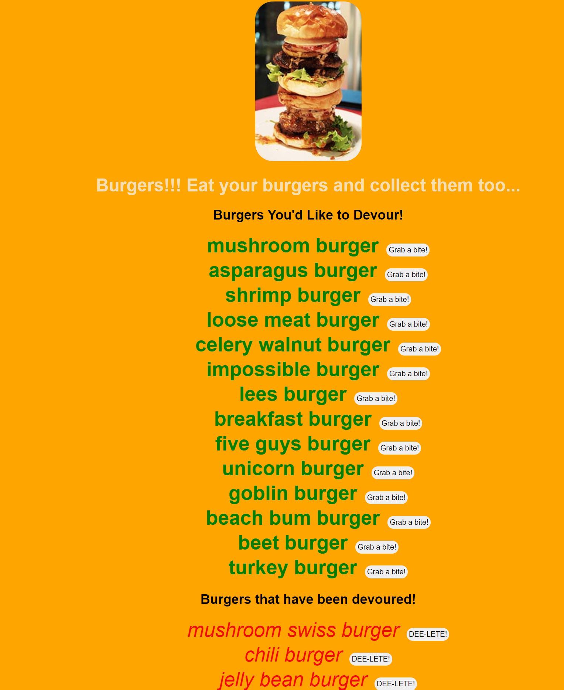

## DALES BURGER APP

## TABLE OF CONTENTS

- [CONTRIBUTORS](#CONTRIBUTORS)
- [USER STORY](#USER-STORY)
- [DESCRIPTION](#DESCRIPTION)
- [REFERENCE LINKS](#REFERENCE-LINKS)
  - [Dale's Burger  Application :: Live Link](https://safe-dusk-58943.herokuapp.com/)
  - [Dale's Burger Application :: GitHub Repo](https://github.com/drkittendorf/13-burger)
- [LANGUAGES AND TOOLS](#LANGUAGES-AND-TOOLS)
- [CORE PROJECT TECHNOLOGIES](#CORE-PROJECT-TECHNOLOGIES)
- [CORE NODE DEPENDENCIES](#CORE-NODE-DEPENDENCIES)
- [FUTURE DEVELOPMENT](#FUTURE-DEVELOPMENT)
- [LICENSING](#LICENSING)
- [SCREENSHOTS](#SCREENSHOTS-AND-VIDEO)

---
## CONTRIBUTORS
Dale Kittendorf

 

---

## USER STORY

- As a serious burger connoisseur
- I want to be able to view and devour a variety of burgers
- SO THAT I can organize my burgers and keep track of the burgers I have devoured and thos I have yet to devour

 

---

## DESCRIPTION

A burger logger with MySQL, Node, Express, Handlebars and a homemade ORM. Following the MVC design pattern; using Node and MySQL to query and route data in the app, and Handlebars to generate HTML.

 

---

## REFERENCE LINKS

Link to **Dale's Burger App** deployed on `HEROKU` - [Application Live Link](https://drkittendorf.github.io/productivity/)

Link to **GitHub Repo** used for application development - [Application GitHub Repo](https://github.com/drkittendorf/productivity)

 

---

## LANGUAGES AND TOOLS:

 
 

---

### CORE PROJECT TECHNOLOGIES

Here is a list of all the core technologies used to develop this application.

- `mysql`

### CORE NODE DEPENDENCIES

The dependencies listed below are all the core NPM packages used throughout the project.

- 
- 

 

---

## FUTURE DEVELOPMENT

For `future` development, I would like to incorporate the following `enhancements`:

-

---

## LICENSING
  

The code in this project is licensed under MIT license.

---

## SCREENSHOTS AND VIDEO

- ### SCREENSHOT(S)  

 

- ### VIDEO
        (TBD)
 

---